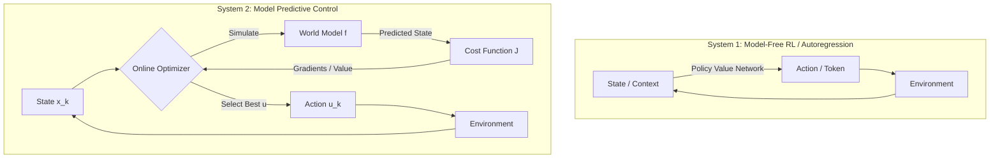

# The Control-Theoretic Imperative
## Shifting from Amortized Reflexes to Online Optimization

### Executive Summary

The contemporary landscape of Artificial Intelligence stands at a paradoxical inflection point. While autoregressive Large Language Models (LLMs) and model-free Deep Reinforcement Learning (DRL) have achieved remarkable feats, they are asymptotically approaching a "competence wall." This report advances a structural thesis: to achieve Artificial General Intelligence (AGI), we must shift from **learning a policy** (amortized reflexes) to **learning a model for planning**. This defines the **Control-Theoretic Imperative**, advocating for Model Predictive Control (MPC) as the cognitive engine of AGI.

### The Problem: The Stagnation of Reflexive Intelligence

Current architectures—both autoregressive LLMs and model-free RL policies—are fundamentally **"System 1" technologies**. They rely on "amortized intelligence," where computational heavy lifting is performed during training, compressing the solution space into static weights.

*   **Reflexive Execution**: At inference time, these models function reflexively, executing a forward pass that maps states to tokens based on historical correlations.
*   **The Competence Wall**: They cannot reason over long horizons or adapt to novel physics without retraining. They do not "think"; they retrieve.

### The Solution: Model Predictive Control (MPC)

MPC is not merely an algorithm but a cognitive framework predicated on **online, receding-horizon optimization**. Unlike RL, which memorizes optimal actions, MPC solves a fresh optimization problem at every time step.

#### The MPC Loop (System 2)
1.  **Observe**: Measure the current state $x_k$.
2.  **Imagine**: Use an internal World Model $f(x, u)$ to stimulate future trajectories.
3.  **Evaluate**: Score trajectories against a cost function $J$.
4.  **Act**: Execute the first optimal action $u^*_{k|k}$.
5.  **Repeat**: At $k+1$, re-measure and re-plan.

### Visualizing the Architecture

The difference between Amortized RL and MPC is the difference between a cached lookup table and an active reasoning engine.



### Theoretical Foundations: The Divergence

To rigorously evaluate the suitability of MPC versus RL for AGI, we deconstruct their mathematical formulations. Both solve the Optimal Control Problem, but diverge in handling time.

**Reinforcement Learning (The Bellman Trap)**
$$V^\pi(s) = \mathbb{E}_{a \sim \pi, s' \sim \mathcal{P}} [r(s,a) + \gamma V^\pi(s')]$$
The policy $\pi_\theta$ is "compiled" during training. If the environment shifts, the policy is mathematically incapable of adapting without gradient updates.

**Model Predictive Control (Receding Horizon)**
At time $k$, solve:
$$\min_{\mathbf{u}} J_N(x_k, \mathbf{u}) = \sum_{i=0}^{N-1} \ell(x_{k+i|k}, u_{k+i|k}) + V_f(x_{k+N|k})$$
Subject to dynamics $x_{k+i+1|k} = f(x_{k+i|k}, u_{k+i|k})$ and constraints. This loop implies the agent is never "done" thinking. It constantly re-derives the optimal policy locally.

### Comparative Analysis

| Feature | Reinforcement Learning (Model-Free) | Large Language Models (Autoregressive) | Model Predictive Control (Hybrid/AGI) |
| :--- | :--- | :--- | :--- |
| **Core Mechanism** | Amortized Policy $\pi(s)$ | Next-Token Prediction $P(x_{t+1}|x_t)$ | Online Optimization $\min \sum Cost$ |
| **Inference Type** | $O(1)$ Forward Pass (Reflexive) | $O(N)$ Sequential Gen (Reflexive) | Iterative Search/Optimization (Deliberative) |
| **OOD Robustness** | Low (Fails if $s \notin \mathcal{D}_{train}$) | Low (Hallucinates) | High (Re-optimizes for new $s$) |
| **Sample Efficiency** | Very Low (Billions of steps) | Medium (Trillions of tokens) | High (World Model learns from observation) |
| **Cognitive Analogy** | System 1 (Intuition/Habit) | System 1 (Association/Speech) | System 2 (Reasoning/Planning) |

### Implementation: The Differentiable MPC Loop

In modern AGI research (e.g., DiffTORI), the planning process itself is differentiable. Here is a conceptual PyTorch implementation of a simplified MPC planner using a learned World Model.

```python
import torch
import torch.nn as nn

class DifferentiableMPC(nn.Module):
    def __init__(self, world_model, cost_fn, horizon=5):
        super().__init__()
        self.world_model = world_model # f(x, u) -> x_next
        self.cost_fn = cost_fn         # l(x, u) -> scalar
        self.horizon = horizon

    def forward(self, state, initial_action_guess):
        # We want to find actions 'u' that minimize cost
        u_seq = initial_action_guess.clone().requires_grad_(True)
        optimizer = torch.optim.SGD([u_seq], lr=0.1)

        for optimization_step in range(10): # "Thinking" steps
            optimizer.zero_grad()
            current_state = state
            total_cost = 0

            # 1. Unroll the trajectory (Simulate)
            for t in range(self.horizon):
                action = u_seq[t]
                next_state = self.world_model(current_state, action)
                step_cost = self.cost_fn(next_state, action)
                
                total_cost += step_cost
                current_state = next_state # Recurrent connection

            # 2. Backpropagate through time (Optimization)
            total_cost.backward()
            
            # 3. Update the plan
            optimizer.step()

        # Return the first optimized action (Receding Horizon)
        return u_seq[0].detach()
```

### The Autoregressive Trap & Inference-Time Compute

Recent investigations into scaling laws suggest that parameter scaling is hitting diminishing returns. The breakthrough, exemplified by models like OpenAI's o1 or DeepMind's MuZero, is to introduce **"thinking time"**—effectively performing search/optimization at inference.

Standard LLMs lack **Lookahead** and **Backtracking**. They pick a token and commit. This is Single-Shooting without terminal cost. MPC, by contrast, explores the tree of thoughts.

> "The research indicates that no single inference-time technique consistently performs well... simply scaling search-based inference often diminishes due to Error Propagation."

This reinforces the need for a **Learned World Model** separate from the policy.

### The Convergence: Latent World Models

The future of AGI is in **Latent World Models** (like **DreamerV3** and **JEPA**).
*   **DreamerV3**: Performs MPC in a latent space ($z_t$). It imagines trajectories of latent states and optimizes a policy within this "dream."
*   **JEPA (Yann LeCun)**: Rejects pixel prediction. Predicts abstract **representation**. A house cat has a better world model than GPT-4 because it understands physics, not just texture.

### Conclusion: The "System 2" Era

The era of "Pure RL" and "Pure Autoregression" is ending. The future AGI architecture will be a Hierarchical Model Predictive Control System:
1.  **Perception**: Compressing the world into abstract states (JEPA).
2.  **Memory**: A learned World Model predicting evolution.
3.  **Values**: A learned Value Function estimating long-term utility.
4.  **Reasoning**: An online MPC Planner (ToT/DiffTORI) effectively "thinking" by simulating trajectories.

In this paradigm, intelligence is defined not by static knowledge, but by the dynamic capacity to simulate, evaluate, and choose.
